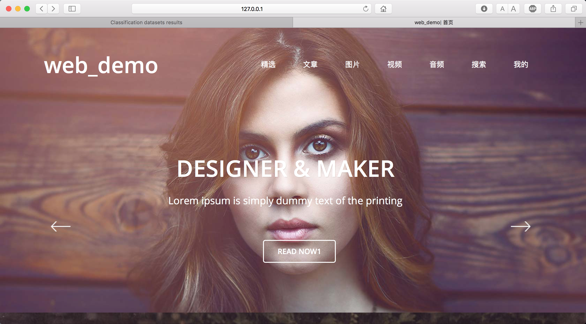
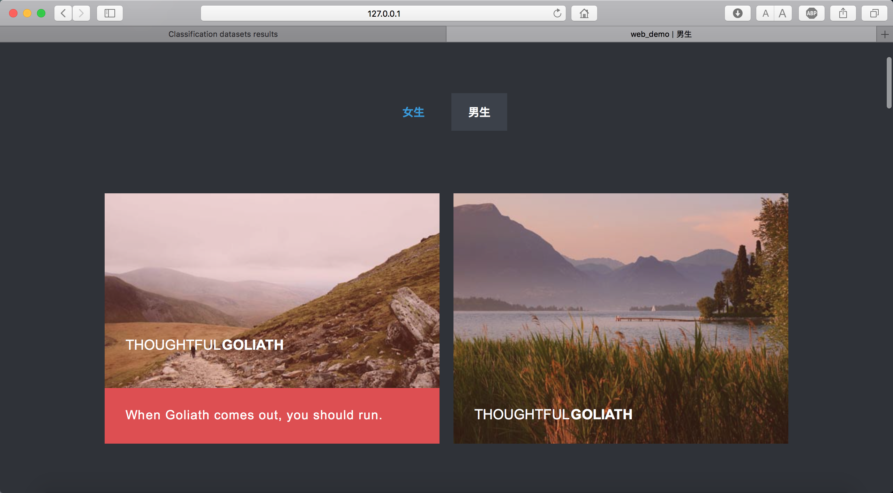
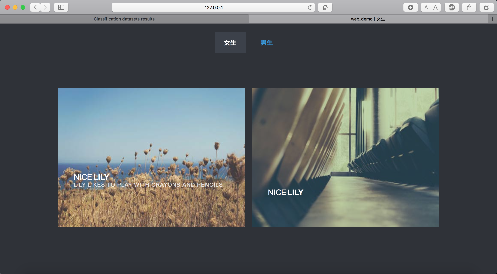
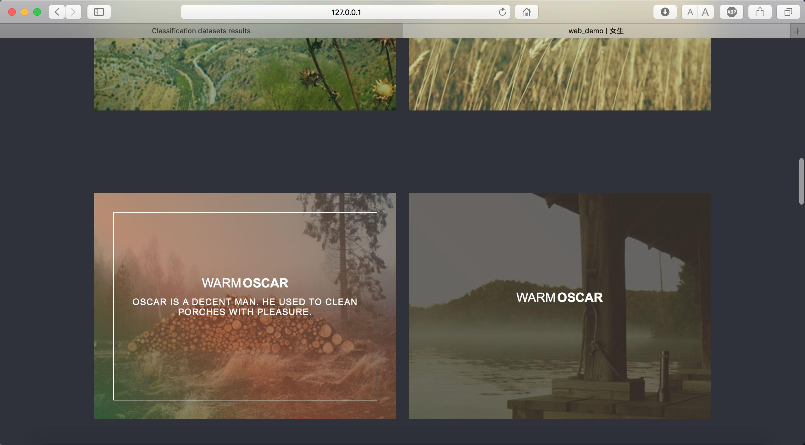
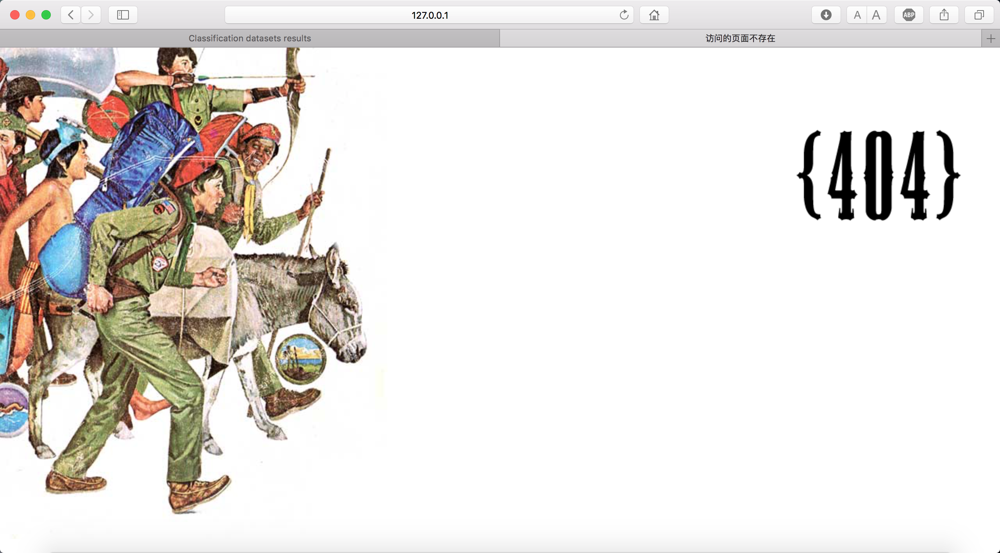

# Web Template
A JavaEE Web Template

## Requirements
- JDK
- MySQL
- Maven

## Usage
Using IntelliJ IDEA to open this project, then open the right tab named 
`Maven Projects`, find `parent/Lifecycle`, double click `clean`, then double
click `install`, finally go to `front/Plugins/jetty`, double click `jetty:run` to 
run this web application. Click `jetty:stop` to stop this web application.

This web application now can be accessed by going to `127.0.0.1:8080` in your browser.

## Web Pages













## Modifies
Open `generator/src/main/resources/generatorConfig.xml`, find

```
<jdbcConnection driverClass="com.mysql.jdbc.Driver"
                connectionURL="jdbc:mysql://127.0.0.1/database"
                userId="userId"
                password="password">
</jdbcConnection>
.........
.........
<table schema="database" tableName="users" domainObjectName="User"/>
```
change your database name、userId、password and table name, then open the 
right tab named `Maven Projects`, find `generator/Plugins/mybatis-generator`,
double click `mybatis-generator:generate` to generate DAO.

Open `front/src/main/resources/application.properties`, find

```
jdbc.url=jdbc:mysql://127.0.0.1:3306/database?characterEncoding=UTF-8
jdbc.username=username
jdbc.password=password
```
change your database name、username and password.

